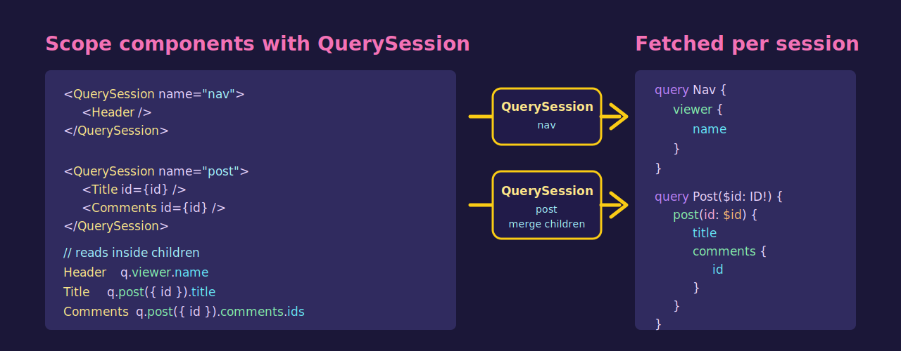

# GQLens [](https://www.npmjs.com/package/@gqlens/core) [](https://github.com/PluxelJS/GQLens/actions/workflows/ci.yml) [](./LICENSE)

<p align="center">
  
</p>

GQLens is a demand-first GraphQL client for React and Solid. Generated accessors feed `QuerySession` scopes; each scope plans, caches, and fetches its own selection.

```sh
pnpm add @gqlens/core @gqlens/react
pnpm add -D @gqlens/codegen @gqlens/vite graphql
```

Use `@gqlens/solid` instead of `@gqlens/react` for Solid.

Read next:

- [Yoga + Vite example](./examples/yoga-vite-codegen/README.md)
- [API syntax spec](./docs/规范-API语法.md)
- [Framework adapters](./docs/06-框架适配.md)
- [Schema design guide](./docs/服务端-Schema设计指南.md)

## Development

```sh
pnpm install
pnpm run verify
pnpm run build
```
